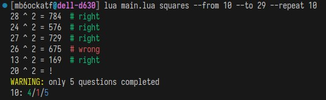

# counttr

mathematics count trainer, written in lua



## usage

once installed, run with `counntr flags-here`. otherwise, `lua main.lua flags-here`

```bash
Arguments:
   {squares,add,multiply,substract,floor_division,root,power,modulo}
                         training mode
Options:
   -h, --help            Show this help message and exit.
   --completion {bash,zsh,fish}
                         Output a shell completion script for the specified
                         shell.
   --repeat <repeat>     number of repetitions
   --from <from>         smaller range border
   --to <to>             larger range border
   --power <power>       power for power action or root
   -n, --no-colors       disable use of colorful output with ascii control
                         sequences
   -c, --colors          (forced) use of colorful output with ascii control
                         sequences. by default, colors are enabled if NO_COLORS
                         environment variable is not set and terminal emulator
                         supports colors.
help is awailable with `--help` option
```

## installation

written in lua, it's needed to have `lua>=5.4` installed.
also, `luarocks>=3.9.2` is needed, because `mfr` and `argparse` packages
(*rocks*) are required. all these things will be installed automatically
provided you use arch linux packaging system
(checkout arch linux package [section](#arch-linux-package))

### arch linux package

clone this repository, and install the package:
```bash
makepkg -sri
```
from project's directory.

open for ideas, bug reports and contributions :)